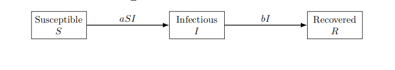
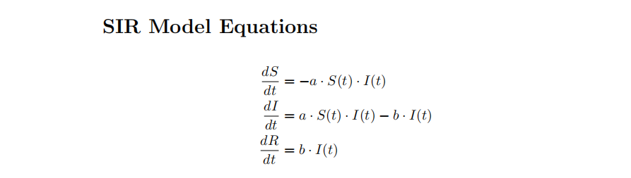
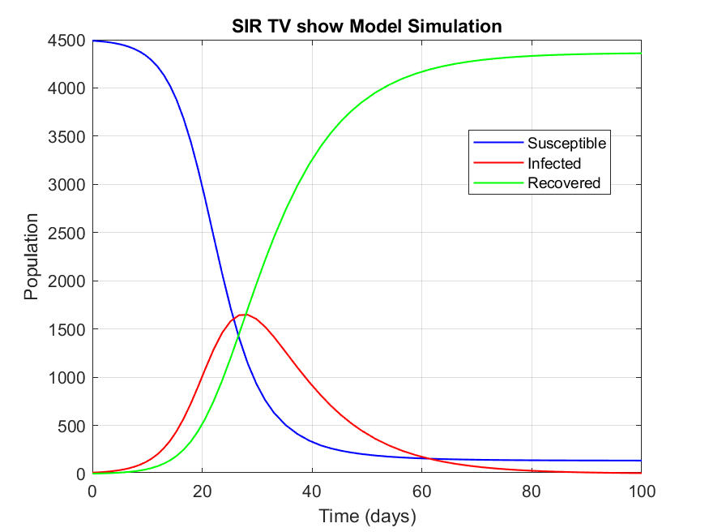
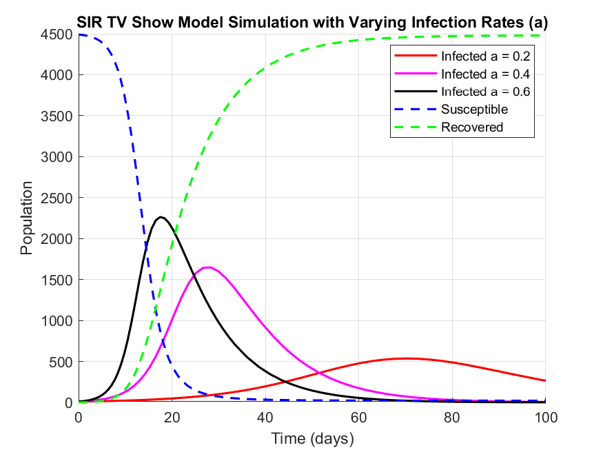
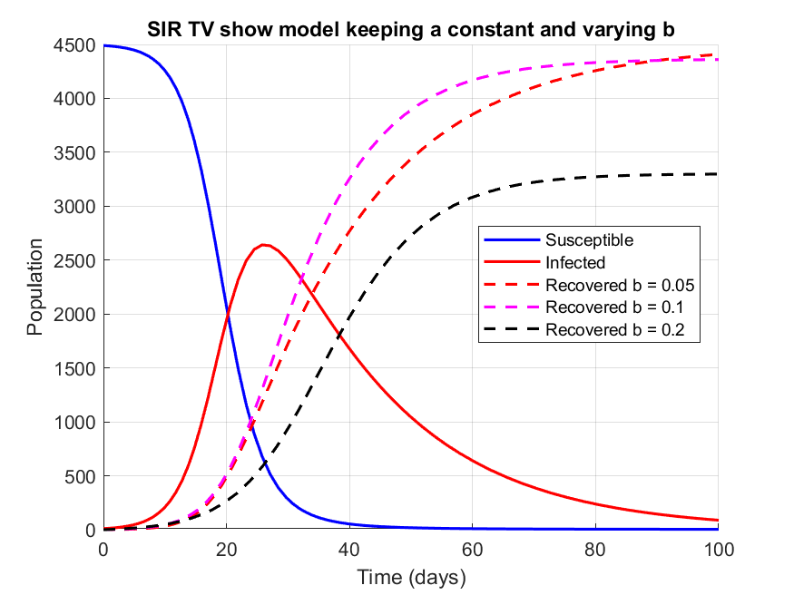

#  TV Show Viewership Spread – SIR Model

The SIR (Susceptible–Infected–Recovered) model is a classic epidemiological framework traditionally used to study the spread of infectious diseases. For example, chickenpox can be modeled using the SIR approach because recovery typically confers lifetime immunity—once recovered, individuals no longer return to the susceptible group.

Beyond infectious diseases, the SIR model’s adaptability makes it valuable for modeling many other dynamic processes where influence or behavior spreads through a population.

This project applies the SIR model to simulate how a TV show’s popularity spreads through word-of-mouth and social media. Inspired by classical disease-spread simulations, it adapts the concept to a cultural phenomenon for a Mathematical Modeling and Simulation course project..

---

##  Scenario
A local streaming platform releases a new TV show. The show becomes a hot topic on social media, leading to rapid word-of-mouth spread.  
- As viewers share their excitement, more people start watching.  
- Over time, those who finish the series stop recommending it.  
- The buzz fades as fewer people are promoting the show.

---
##  Variables

| Variable  | Description                                                                                   |
|-----------|-----------------------------------------------------------------------------------------------|
| S(t)      | Fraction of the population that has not yet watched the TV show (Susceptible).                |
| I(t)      | Fraction of the population currently watching and recommending the show (Infected/Influenced). |
| R(t)      | Fraction of the population who have finished watching and no longer promote the show (Recovered). |
| a         | Contact rate — how fast the influence spreads (per person per day).                           |
| b         | Recovery rate — how fast people lose interest and stop promoting the show (per day).          |
| N         | Total population (e.g., potential viewers).                                                   |

---

##  Schematic Diagram

---

## SIR Model Equations



---

##  Initial Conditions

- **N = 5000**: Total population (potential viewers).

- **I(0) = 10**: Initial number of people watching and promoting the show.

- **R(0) = 0**: Initially, no one has finished watching or lost interest.

- **S(0) = N − I(0) = 4990**: People who haven’t yet watched the show.

- **a = 3**: Contact rate.

- **b = 4**: Recovery rate.

---

##  Assumptions

1. Word-of-mouth influences viewership (e.g., via social media or in-person interactions).

2. People stop promoting the show after they finish or lose interest.

3. No reinfection: viewers who finish the show do not start promoting it again.

4. Constant population: no new viewers enter or leave the system.

5. Spread depends on the frequency of contact between viewers and non-viewers.

## VISUALIZATIONS


### Interpretation: 
- At first, many people start watching and recommending the show, causing infections
(viewership) to rise.

- Over time, more viewers finish the show, stop promoting it, and transition to the
recovered group.

- The infected population peaks and then declines, as fewer susceptible individuals remain.


### Interpretation: 
- Lower a values (e.g., 0.2) lead to slower adoption. As a increases to 0.6, the show becomes
a viral hit — popularity spikes fast but also fades fast due to saturation.



### Interpretation: 
- A lower recovery rate (e.g., b = 0.05) sustains interest longer — the buzz fades slowly.

- A higher rate (e.g., b = 0.2) causes quicker burnout; viewers lose interest fast, and promotion dies out.


## Conclusion
- The SIR model is a powerful framework for understanding how TV show popularity spreads and fades within a community, much like infectious diseases. By adjusting the contact and recovery rates, we can simulate different patterns of word-of-mouth influence and viewer engagement. This helps predict viewership trends and supports effective marketing and content promotion.

- The SIR model can also be applied to other industries such as finance and technology. In finance, it can model how investor sentiment or market panic spreads, helping forecast trends and manage risk. In technology, it can simulate how new products or innovations gain users through word-of-mouth, guiding marketing strategies and launch timing.


## Technologies Used

- MATLAB (or GNU Octave) for solving ODEs (ode45) and plotting.


## ▶ How to Run
1. **Clone the repository**:
   ```bash
   git clone https://github.com/MarilynMaika/SIR_Movie_Modeling.git
   
